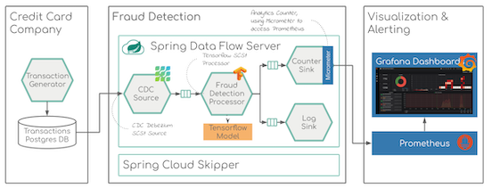
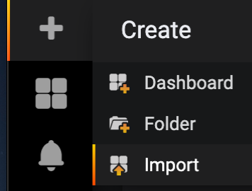
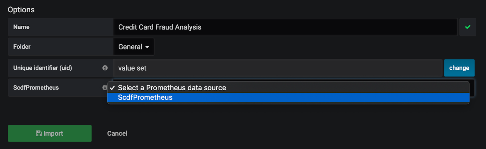
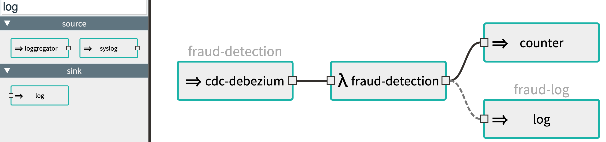
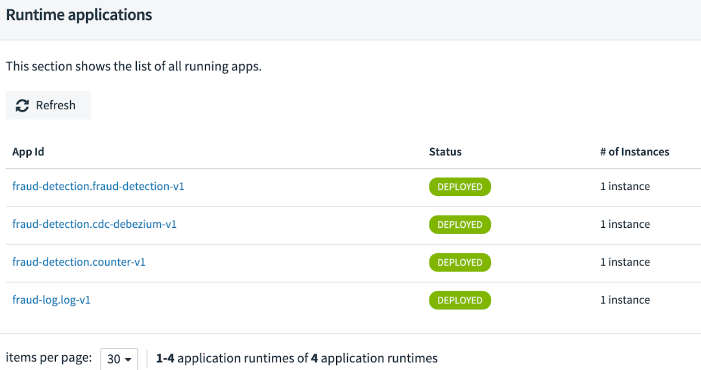
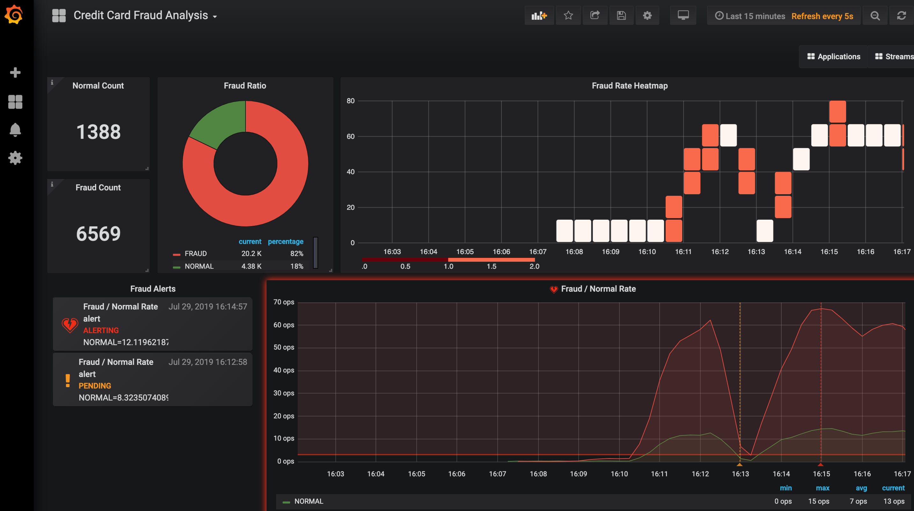

# cdc-fraud-detection-demo
Realtime Credit Card fraud detection, using CDC (Change Data Capture) data source and TensorFlow model from a Kaggle competition.


## Docker Compose Demo




Prerequisite: At least 6-7GB needs to be provided to your Docker daemon! 

### Docker compose installation

* Checkout the https://github.com/tzolov/cdc-fraud-detection-demo project and change the local directory to `docker``:

```
git clone git@github.com:tzolov/cdc-fraud-detection-demo.git
cd cdc-fraud-detection-demo/docker
```

* Download the Spring Cloud Data Flow Server `docker-compose` and `docker-compose-prometheus` installation files:

```
wget https://raw.githubusercontent.com/spring-cloud/spring-cloud-dataflow/master/spring-cloud-dataflow-server/docker-compose.yml
```
```
wget https://raw.githubusercontent.com/spring-cloud/spring-cloud-dataflow/master/spring-cloud-dataflow-server/docker-compose-prometheus.yml
```

* Make sure that all the `docker-compose.yml`, `docker-compose-prometheus.yml` and the `docker-compose.fraud.yml` files are present in the local directory and then start run:

```
export DATAFLOW_VERSION=2.3.0.BUILD-SNAPSHOT
export SKIPPER_VERSION=2.2.0.BUILD-SNAPSHOT
export STREAM_APPS_URI='https://dataflow.spring.io/Einstein-BUILD-SNAPSHOT-stream-applications-kafka-maven&force=true'
docker-compose -f ./docker-compose.yml -f ./docker-compose-prometheus.yml -f ./docker-compose.fraud.yml up
```

* It may take two, three minutes for all containers and services to start. Once ready you should see the following running containers:

```
docker ps -a

IMAGE                                                             PORTS                        NAMES
springcloud/spring-cloud-dataflow-prometheus-local:2.2.0.BS       0.0.0.0:9090->9090/tcp       prometheus
springcloud/spring-cloud-dataflow-prometheus-service-discovery:0.0.4.RELEASE 
                                                                  0.0.0.0:8181->8181/tcp       service-discovery
springcloud/spring-cloud-dataflow-server:2.2.0.BS                 0.0.0.0:9393->9393/tcp       dataflow-server
tzolov/credit-card-transaction-generator:0.0.1-SNAPSHOT           0.0.0.0:8384->8384/tcp       transaction-generator
 confluentinc/cp-kafka:5.2.1                                      9092/tcp                     dataflow-kafka
debezium/example-postgres:0.10                                    0.0.0.0:5432->5432/tcp       postgres-cdc
mysql:5.7.25                                                      3306/tcp, 33060/tcp          dataflow-mysql
springcloud/spring-cloud-dataflow-grafana-prometheus:2.2.0.BS     0.0.0.0:3000->3000/tcp       grafana
 confluentinc/cp-zookeeper:5.2.1                                  2181/tcp, 2888/tcp,3888/tcp  dataflow-kafka-zookeeper
springcloud/spring-cloud-skipper-server:2.1.0.BS                  0.0.0.0:7577->7577/tcp, 
                                                                  0.0.0.0:9000-9010->9000-9010/tcp,         
                                                                  0.0.0.0:20000-20105->20000-20105/tcp skipper
```

### Import Grafana Dashboard

* Open `Grafana UI` at http://localhost:3000 using the username: `admin` and password: `admin`. Skip the request to change the password. 

* From the main menu select `+` and `Import`:



* Use the `Upload Json File` button and select the `/cdc-fraud-detection-demo/grafana/CreditCardFraudAnalysis.json` from the git cloned project.

* Select ScdfPrometheus as data source and press ‘Import’:



This will import a new ‘Credit Card Fraud Analysis’ dashboard and make it accessible via the main menu.

### Deploy Spring Cloud Streams

* Open the SCDF Web dashboard at http://localhost:9393/dashboard/#/streams/definitions and navigate to the  Stream definitions.

* Press ‘Create New Stream’ button and add the following streams:

```
fraud-detection=cdc-debezium --cdc.config.schema.whitelist=cdc --cdc.name=my-sql-connector --cdc.connector=postgres --cdc.config.database.user=postgres --cdc.config.database.password=postgres --cdc.config.database.dbname=postgres --cdc.config.database.hostname=postgres-cdc --cdc.config.database.port=5432 --cdc.config.database.server.name=my-app-connector --cdc.flattering.enabled=true | fraud-detection --model-fetch=output --model='classpath:/fraud_detection_graph.pb' | counter --counter.name=credit --counter.tag.expression.fraud=#jsonPath(payload,'$..detection')

fraud-log=:fraud-detection.fraud-detection > log
```

You should see a diagram like this: 



* Press `Create Stream` button.

* Deploy both (fraud-detection and fraud-log) stream. Wait until all apps are deployed



### Transaction Generator and Fraud Monitoring

* Open the Credit Card Transaction Generator at http://localhost:8384/generator , 

* Configure the desired transaction rate and fraud ration and press the Start button.


* Open the Grafana Fraud dashboard in another window tab and wait for about 1 min for the first metrics to be recorded.

* You can continually change the card transaction rate and fraud ration and should observe the effect in the dashboard



## Kubernetes Demo

Follow the [SCDF Kubernetes Installation](https://dataflow.spring.io/docs/installation/kubernetes/kubectl/) instructions to install SCDF, Skipper and the remaining components including `Prometheus` and `Grafana`

As a shortcut run the following commands from the `spring-cloud-dataflow` directory: 
```bash
kubectl create -f src/kubernetes/kafka/
kubectl create -f src/kubernetes/mysql/

kubectl create -f src/kubernetes/prometheus-proxy/

kubectl create -f src/kubernetes/prometheus/prometheus-clusterroles.yaml
kubectl create -f src/kubernetes/prometheus/prometheus-clusterrolebinding.yaml
kubectl create -f src/kubernetes/prometheus/prometheus-serviceaccount.yaml
kubectl create -f src/kubernetes/prometheus/prometheus-configmap.yaml
kubectl create -f src/kubernetes/prometheus/prometheus-deployment.yaml
kubectl create -f src/kubernetes/prometheus/prometheus-service.yaml

kubectl create -f src/kubernetes/grafana/

kubectl create -f src/kubernetes/server/server-roles.yaml
kubectl create -f src/kubernetes/server/server-rolebinding.yaml
kubectl create -f src/kubernetes/server/service-account.yaml

kubectl create -f src/kubernetes/skipper/skipper-config-kafka.yaml
kubectl create -f src/kubernetes/skipper/skipper-deployment.yaml
kubectl create -f src/kubernetes/skipper/skipper-svc.yaml

kubectl create -f src/kubernetes/server/server-config.yaml
kubectl create -f src/kubernetes/server/server-svc.yaml
kubectl create -f src/kubernetes/server/server-deployment.yaml
```
This will deploy SCDF, Skipper with MySQL and Kafka. Also Prometheus, Prometheus-Rsocket and Grafana are installed 

For the CDC Fraud demo add the following additional commands: 
```bash
kubectl create -f kubernetes/postgres-cdc/
kubectl create -f kubernetes/generator/
```
Later deploys the `Transaction Generator` and `PostgreSQL-CDC` in k8s. 

From the SCDF UI Apps register the following apps:

* Bulk import of https://dataflow.spring.io/Einstein-BUILD-SNAPSHOT-stream-applications-kafka-docker
* name: `cdc-debezium`, type: `Source`, uri: `docker://springcloudstream/cdc-debezium-source-kafka:latest`, metadata-uri: `maven://org.springframework.cloud.stream.app:cdc-debezium-source-kafka:jar:metadata:1.0.0.BUILD-SNAPSHOT`
* name: `fraud-detection`, type: `Processor`, uri: `docker://tzolov/fraud-detection-processor-kafka:latest`, metadata-uri: `https://dl.bintray.com/big-data/maven/fraud-detection-processor-kafka-1.0.1-metadata.jar`

Then follow the [Import Grafana Dashboard](https://github.com/tzolov/cdc-fraud-detection-demo#import-grafana-dashboard), [Deploy Spring Cloud Streams](https://github.com/tzolov/cdc-fraud-detection-demo#deploy-spring-cloud-streams) and [Transaction Generator and Fraud Monitoring](https://github.com/tzolov/cdc-fraud-detection-demo#transaction-generator-and-fraud-monitoring) instructions above.

```
kubectl delete all,cm,svc -l app=generator
kubectl delete all,cm,svc -l app=postgres-cdc
```
---
Test task metrics: docker://tzolov/task-demo-metrics:latest
